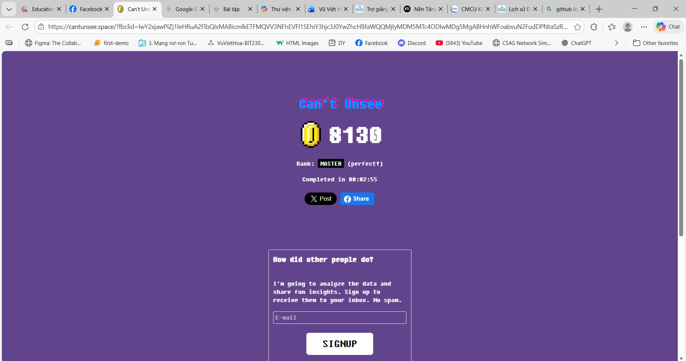
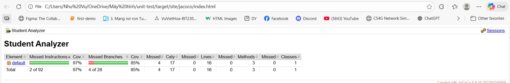
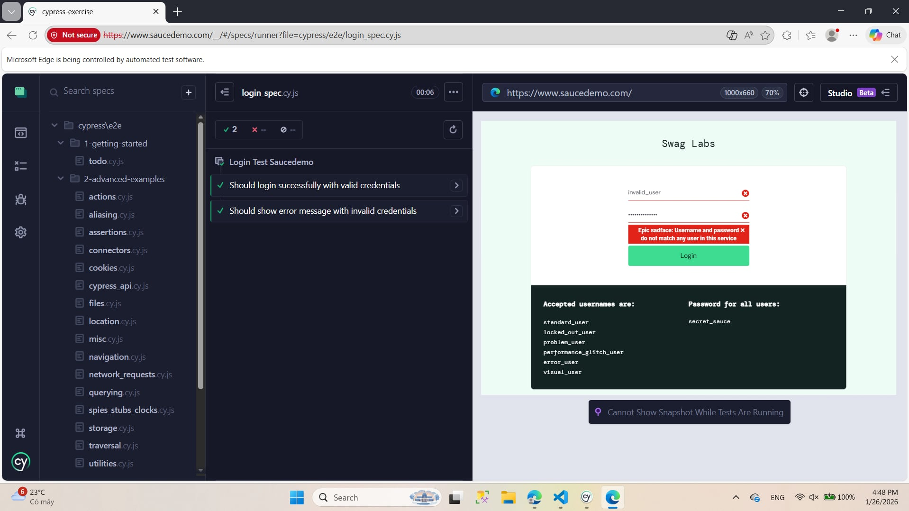
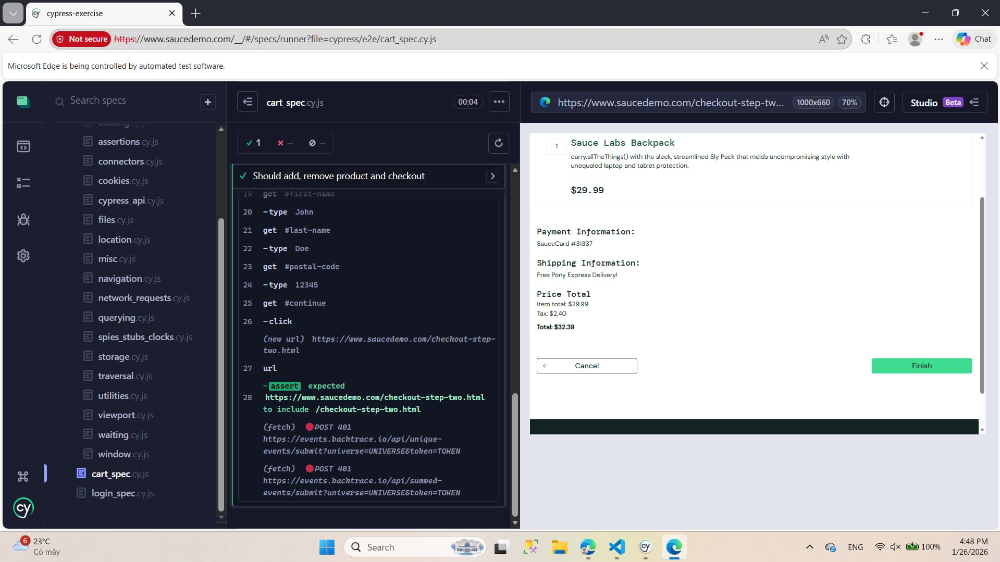

# Bài Tập Unit Test với JUnit 5 - Phân tích điểm học sinh

## Thông tin sinh viên
- **Họ và tên**: Vũ Việt Hòa
- **MSSV**: BIT230162
- **Lớp**: 23IT5

## Bài tập - Trải nghiệm giao diện UI Quality (Can't Unsee)



Đây là bài tập thực hành kiểm tra UI/UX Design Awareness trên trang web Can't Unsee. Bài tập yêu cầu:

- Xác định và so sánh sự khác biệt giữa các mẫu thiết kế giao diện
- Nhận biết các vấn đề UI/UX thông thường
- Hiểu rõ hơn về các nguyên tắc thiết kế giao diện tốt

**Mục tiêu**: Nâng cao nhận thức về chất lượng thiết kế giao diện và kỹ năng quan sát chi tiết.

## Mô tả dự án

Dự án thực hành Unit Test sử dụng JUnit 5 để kiểm thử các hàm phân tích điểm học sinh. Mục đích là viết các test case bao quát (normal case, edge case, exception case) để đảm bảo tính đúng đắn của các hàm trong lớp `StudentAnalyzer`.

## 1. Chức năng chính

Lớp `StudentAnalyzer` cung cấp hai chức năng chính:

### countExcellentStudents(List<Double> scores)
**Mô tả**: Đếm số lượng học sinh có điểm >= 8.0

- Xử lý các điểm không hợp lệ (null, < 0, > 10)
- Trả về 0 nếu danh sách rỗng hoặc null

### calculateValidAverage(List<Double> scores)
**Mô tả**: Tính điểm trung bình của các điểm hợp lệ (0-10)

- Chỉ tính trung bình các điểm trong khoảng [0, 10]
- Bỏ qua các điểm null, âm hoặc vượt quá 10
- Trả về 0.0 nếu không có điểm hợp lệ

## 2. Cấu trúc dự án

```
unit-test/
├── README.md                          
├── src/
│   └── StudentAnalyzer.java           
├── test/
│   └── StudentAnalyzerTest.java      
├── pom.xml                          
├── build.gradle                      
├── JACOCO_SETUP.md                    
├── coverage.ps1                       
└── lib/                               
```

## 3. Các Test Case được thực hiện

### Test 1: testCountExcellentStudents()
- **Input**: [9.0, 8.5, 7.0, 11.0, -1.0]
- **Expected**: 2 (9.0 và 8.5 >= 8.0, loại bỏ 11.0 và -1.0 vì ngoài phạm vi)
- **Kết quả**: ✅ Passed

### Test 2: testCalculateValidAverage()
- **Input**: [9.0, 8.5, 7.0]
- **Expected**: 8.16 (với sai số 0.01)
- **Tính toán**: (9.0 + 8.5 + 7.0) / 3 = 8.166...
- **Kết quả**: ✅ Passed

### Test 3: testCountExcellentNormal()
- **Input**: [9.0, 8.5, 7.0, 11.0, -1.0]
- **Expected**: 2
- **Kết quả**: ✅ Passed

### Test 4: testCountExcellentEmpty()
- **Input**: [] (danh sách trống) hoặc null
- **Expected**: 0
- **Kết quả**: ✅ Passed

### Test 5: testCountExcellentBoundaries()
- **Input**: [0.0, 10.0]
- **Expected**: 1
- **Kết quả**: ✅ Passed

### Test 6: testCountExcellentAllInvalid()
- **Input**: [-5.0, 15.5, 20.0]
- **Expected**: 0
- **Kết quả**: ✅ Passed

### Test 7: testAverageAllValid()
- **Input**: [9.0, 8.0, 7.0]
- **Expected**: 8.0
- **Kết quả**: ✅ Passed

### Test 8: testAverageMixed()
- **Input**: [9.0, -1.0, 7.0, 11.0]
- **Expected**: 8.0
- **Kết quả**: ✅ Passed

### Test 9: testAverageEmpty()
- **Input**: []
- **Expected**: 0.0
- **Kết quả**: ✅ Passed

### Test 10: testAverageMinMax()
- **Input**: [0.0, 10.0]
- **Expected**: 5.0
- **Kết quả**: ✅ Passed

### Test 11: testAverageInvalidScores()
- **Input**: [5.0, -10.0, 10.1]
- **Expected**: 5.0
- **Kết quả**: ✅ Passed

## 3.1. Black-Box Testing

Black-box testing là kỹ thuật kiểm thử dựa trên input/output mà không cần biết cấu trúc nội bộ của code.

### Test 12: testBlackBoxValidMiddle()
**Kỹ thuật**: Equivalence Partitioning - Phân vùng tương đương
- **Mô tả**: Kiểm tra các điểm hợp lệ nằm ở giữa khoảng [0, 10]
- **Input**: [5.0, 6.5, 7.5]
- **Expected**: 
  - countExcellentStudents: 0 (không có điểm >= 8.0)
  - calculateValidAverage: 6.333 (với sai số 0.001)
- **Phân vùng**: Vùng 1 - Điểm hợp lệ < 8.0
- **Kết quả**: ✅ Passed

### Test 13: testBlackBoxBoundaries()
**Kỹ thuật**: Boundary Value Analysis - Kiểm tra giá trị biên
- **Mô tả**: Kiểm tra các giá trị biên của khoảng hợp lệ
- **Input**: [0.0, 8.0, 10.0]
- **Expected**:
  - countExcellentStudents: 2 (8.0 và 10.0 >= 8.0)
  - calculateValidAverage: 6.0
- **Biên kiểm tra**: 
  - 0.0 (min boundary)
  - 8.0 (threshold boundary)
  - 10.0 (max boundary)
- **Kết quả**: ✅ Passed

### Test 14: testCountExcellentAtBoundary()
**Kỹ thuật**: Exact Boundary Testing
- **Mô tả**: Kiểm tra ngưỡng chính xác 8.0 (>= 8.0 hay > 8.0)
- **Input**: [8.0]
- **Expected**: 1
- **Giá trị kiểm tra**: Ngưỡng 8.0 phải được tính là học sinh giỏi
- **Kết quả**: ✅ Passed

## 3.2. White-Box Testing

White-box testing (hay Glass-box testing) là kỹ thuật kiểm thử dựa trên cấu trúc nội bộ của code, đảm bảo tất cả các nhánh điều kiện được thực thi.

### Test 15: testWhiteBoxDecisionCoverage()
**Kỹ thuật**: Decision/Branch Coverage - Phủ quyết định
- **Mô tả**: Kiểm tra tất cả các nhánh if/else trong code
- **Mục tiêu kiểm thử**:
  1. **Nhánh 1**: score == null (bỏ qua)
  2. **Nhánh 2**: score < 0 (bỏ qua)
  3. **Nhánh 3**: score > 10 (bỏ qua)
  4. **Nhánh 4**: score >= 8.0 (đếm)
  5. **Nhánh 5**: score < 8.0 và >= 0 (bỏ qua)
  
**Test Case Chi Tiết**:
```
Input: [null, -1.0, 5.0, 8.0, 11.0, 9.5]
- null: bỏ qua (nhánh null check)
- -1.0: bỏ qua (nhánh < 0)
- 5.0: bỏ qua (nhánh >= 0 && <= 10 nhưng < 8.0)
- 8.0: đếm (nhánh >= 8.0)
- 11.0: bỏ qua (nhánh > 10)
- 9.5: đếm (nhánh >= 8.0)

Expected: 2
```
- **Path Coverage**: Đảm bảo tất cả paths được thực thi
- **Kết quả**: ✅ Passed

### Test 16: testWhiteBoxLoopCoverage()
**Kỹ thuật**: Loop Coverage - Phủ vòng lặp
- **Mô tả**: Kiểm tra vòng lặp for with different scenarios
- **Test Scenarios**:
  1. **0 iterations**: List rỗng → không vào loop
  2. **1 iteration**: List có 1 phần tử → vào loop 1 lần
  3. **Multiple iterations**: List có nhiều phần tử → vào loop nhiều lần
  
**Input 1** (0 iterations): []
- **Expected**: 0
- **Kết quả**: ✅ Passed

**Input 2** (1 iteration): [9.0]
- **Expected**: 1
- **Kết quả**: ✅ Passed

**Input 3** (multiple iterations): [7.0, 8.0, 9.0, 10.0]
- **Expected**: 3 (8.0, 9.0, 10.0)
- **Kết quả**: ✅ Passed

### Tóm tắt White-Box vs Black-Box Testing

| Kỹ thuật | Tiếp cận | Mục tiêu | Test Cases |
|----------|----------|----------|-----------|
| **Black-Box** | Bên ngoài (Input/Output) | Kiểm thử chức năng | Test 12, 13, 14 |
| **White-Box** | Bên trong (Cấu trúc code) | Phủ tất cả branches/paths | Test 15, 16 |
| **Boundary** | Giá trị biên | Kiểm tra edge cases | Test 5, 10, 13 |
| **Equivalence** | Phân vùng dữ liệu | Chia thành các class | Test 12 |


### Giới thiệu JaCoCo

JaCoCo (Java Code Coverage) là công cụ đo lường độ phủ code, giúp xác định bao nhiêu phần trăm source code được kiểm thử bởi các unit test.

### Hình ảnh j ###



## Cypress - E2E Testing (Cypress Exercise)

### Giới thiệu Cypress

Cypress là một framework E2E (End-to-End) testing hiện đại cho các ứng dụng web. Dự án bao gồm một folder `cypress-exercise` để thực hành Cypress testing.

### login_spec.cy ###

### cart_spec.cy ###



